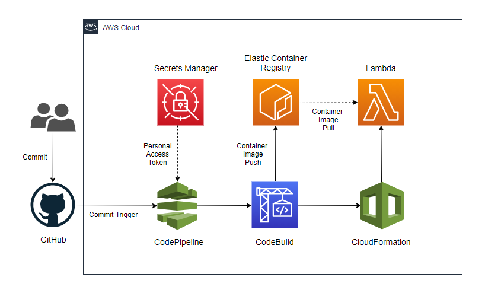
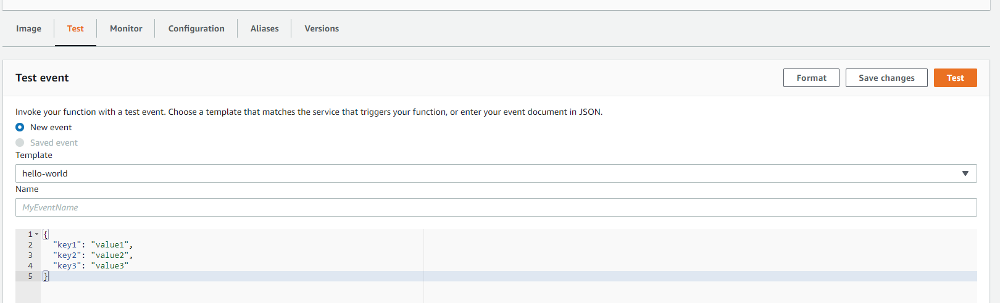
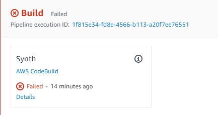
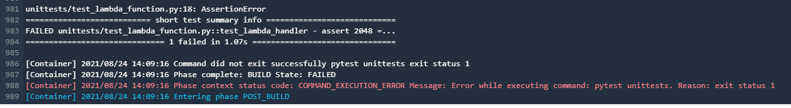
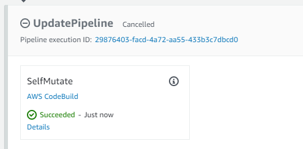

## CDK Pipelines Demo

Cloud Development Kit (CDK) Pipelines is a library that makes it easy to deploy CI/CD Pipelines using [AWS CodePipeline](https://aws.amazon.com/codepipeline/).

In this demo you will deploy a pipeline in CodePipeline which is triggered when new commits are pushed to a GitHub repository. The pipeline runs some unit tests and mutates the pipeline if any changes have been made in the git repository. Finally, it builds a container image, uploads it to [AWS Elastic Container Registry](https://aws.amazon.com/ecr/) and deploys the container to [AWS Lambda](https://aws.amazon.com/lambda/).

**PLEASE NOTE:** This sample is intended for proof of concept or demo use cases, and not for production workloads.

### Index

- [Architecture](#architecture)
- [Usage](#usage)
  - [Prerequisites](#prerequisites)
  - [Prepare your GitHub repository](#Prepare-your-GitHub-repository)
  - [Deploy to AWS](#Deploy-to-AWS)
- [Testing](#Testing)
  - [Pushing Code to the Lambda function](#Pushing-Code-to-the-Lambda-function)
  - [Test a failure on the unit tests](#Test-a-failure-on-the-unit-tests)
  - [Pipeline Mutation](#pipeline-mutation)
- [Removing the Pipeline and Other Resources](#Removing-the-Pipeline-and-Other-Resources)
- [Contributing](#contributing)
- [License Summary](#License-Summary)

### Architecture

<p align="center">
  
</p>

### Usage

> **Note**  
> You are responsible for the cost of the AWS services used while running this sample deployment. There is no additional cost for using this sample. For full details, see the following pricing pages for each AWS service you will be using in this sample. Prices are subject to change.
>
> - [AWS CodeBuild](https://aws.amazon.com/codebuild/pricing/)
> - [AWS CodePipeline](https://aws.amazon.com/codepipeline/pricing/)
> - [AWS Lambda](https://aws.amazon.com/lambda/pricing/)
> - [AWS Secrets Manager](https://aws.amazon.com/secrets-manager/pricing/)
> - [Amazon Elastic Container Registry](https://aws.amazon.com/ecr/pricing/)

#### Prerequisites

To deploy the demo, you will require:

- an AWS account. If you don’t already have an AWS account, create one at <https://aws.amazon.com> by following the on-screen instructions.
- a GitHub account. You can create an account at <https://github.com/>.
- the [AWS CDK](https://docs.aws.amazon.com/cdk/latest/guide/getting_started.html#getting_started_install) installed and bootstrapped.
- [AWS CLI](https://docs.aws.amazon.com/cli/latest/userguide/cli-chap-welcome.html) with [credentials configured](https://docs.aws.amazon.com/cli/latest/userguide/cli-configure-files.html) which will also be used by the CDK. [Administrator Access](https://docs.aws.amazon.com/cdk/api/latest/python/aws_cdk.pipelines/README.html#provisioning-the-pipeline) is recommend but this is only for the initial deployment of the pipeline.
- Python 3.6 or newer.

#### Prepare your GitHub repository

1. [Fork](https://docs.github.com/en/get-started/quickstart/fork-a-repo) this repository to your own GitHub account
2. Create a [Personal Access Token](https://docs.github.com/en/github/authenticating-to-github/keeping-your-account-and-data-secure/creating-a-personal-access-token) for your repository with the scopes:
   - `repo`
   - `admin:repo_hook`
3. Use AWS Secrets Manager to store the Personal Access Token. Adding the Token to the `secret-string` parameter
   ```
   aws secretsmanager create-secret --name lambda_container_cdk_pipeline_github --description 'OAuth token for Github Repo.' --secret-string '{"github":"YOUR_TOKEN_HERE"}'
   ```
4. Clone the forked repository from your own account

   ```
   git clone YOUR_FORKED_REPOSITORY
   ```

5. In the `pipeline/pipeline_stack.py` file, on line 44, add your GitHub username

6. Commit the change to your repository

   ```
   git add pipeline/pipeline_stack.py
   git commit -m "Added GitHub username to pipeline file."
   git push
   ```

#### Deploy to AWS

1. Create a Python virtual environment and install the required libraries

   ```
   python3 -m venv venv
   source venv/bin/activate
   pip3 install -r requirements.txt
   ```

2. Deploy the pipeline

   ```
   cdk synth
   cdk deploy
   ```

3. Ensure the pipeline completes an initial deployment of the Lambda function. You can confirm this by checking that the newly created pipeline has a status of "Succeeded" in the CodePipeline section of the AWS Console.

### Testing

#### Pushing Code to the Lambda function

To make a change to the code of the Lambda function, edit the `handler.py` file. Append some text to the return value and then push the code to your repository.

This will trigger a release and the change will begin running through the pipeline. Once finished the function can be tested via the console.

<p align="center">
  
</p>

#### Test a failure on the unit tests

The pipeline has three unit tests to demonstrate the process. These are defined in `unittests/test_lambda_function.py`.

To create a failure, in `pipeline/lambda_stack.py` edit either the `memory_size` or the `timeout` and change them to differ from the initial values of 1024 for `memory_size` and 30 for `timeout`.

Once the code is pushed the pipeline will run again, but this time it will fail at the initial build Stage.

<p align="center">
  
</p>

Then using the `Tail Log` option you can see the relevant failure output

<p align="center">
  
</p>

Restore the pipeline by changing the settings back to the original values.

#### Pipeline Mutation

Pipelines created by CDK Pipelines will self mutate based on your code.

To demonstrate this, in `pipeline/pipeline_stack.py` uncomment lines 82 and 83

```
lambda_function2 = ApplicationStageLambda1(self, 'Container-CDK-Pipeline-Lambda-Stage2')
lambda_function_stage2 = pipeline.add_stage(lambda_function2, pre=[buildContainerProject])
```

This will tell the pipeline to deploy a second Lambda Function using our container image.

Once the changes are pushed to GitHub, the pipeline will run and you will notice the execution restart at the UpdatePipeline step.

<p align="center">
  
</p>

This is because the pipeline has determined a mutation is required and will now execute with the second Lambda as part of the deployment.

You should now see your pipeline has changed and a stage to deploy the second Lambda function has been added without any changes made directly to CodePipeline.

<p align="center">
  
</p>

If you now re-comment lines 83 and 84 you will see that the pipeline mutates again and the stage is removed.

### Removing the Pipeline and Other Resources

To full remove the created resources, run the following CLI commands:

```
cdk destroy cdk-pipelines-demo/Container-CDK-Pipeline-Lambda-Stage1/Demo-Lambda1
cdk destroy cdk-pipelines-demo/Container-CDK-Pipeline-Lambda-Stage2/Demo-Lambda2
cdk destroy cdk-pipelines-demo
aws ecr delete-repository --repository-name YOUR_ECR_REPO --force
aws secretsmanager delete-secret --secret-id lambda_container_cdk_pipeline_github --force-delete-without-recovery
```

### Contributing

Contributions are more than welcome. Please read the [code of conduct](CODE_OF_CONDUCT.md) and the [contributing guidelines](CONTRIBUTING.md).

### License Summary

This library is licensed under the MIT-0 License. See the LICENSE file.
